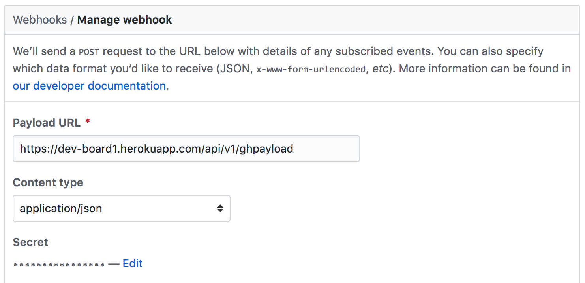
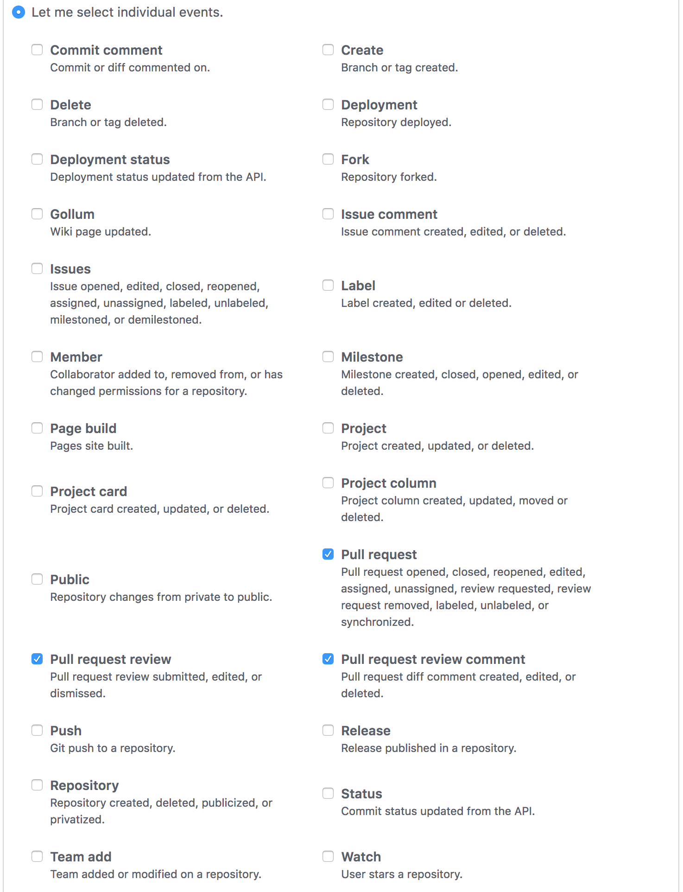
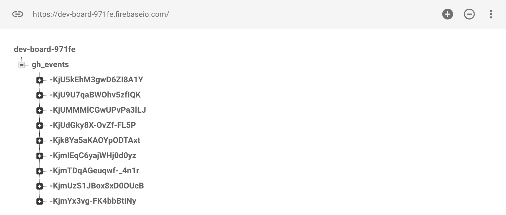
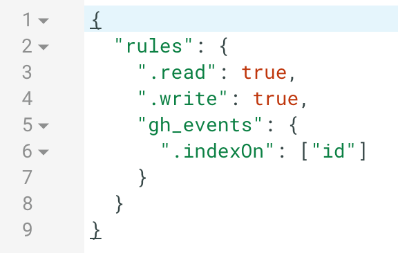

## **DevBoard**

This is a single-page application built with a ReactJS frontend, Rails API, and Firebase.

The purpose is to provide a unified interface to view information related to developers coming from many different sources.  Currently, only Github is available, but I have an interest in adding other platforms such as CircleCI for monitoring continuous integration builds and JIRA for issue tracking.

It is possible to set DevBoard up to track any Github repository as long as the requisite setup is performed.

```
1. Clone this repository
2. Run `npm install` to install dependencies defined in package.json
3. Run `bundle install` to install dependencies defined in Gemfile
```

#### **Github Setup**

This project relies on the Webhooks provided by Github, with settings as shown below.  For a new setup, the secret can be generated using the example shown in the Github docs (https://developer.github.com/webhooks/securing/) and then set as ENV`GH_SECRET_TOKEN`.



---

The API is equipped to handle the following events:


#### **Firebase Setup**

To set up the Firebase database, it will be necessary to set up an environment variable as ENV`FIREBASE_URL` with the URL of the database.  Events from Github are configured to be stored in a database reference called `gh_events`.  The database rules also need to be configured so that it is possible to search the events based on the Pull Request ID from Github.

Database Setup Example:


---

Database Rules Setup Example:



Since the React frontend also reads from the Firebase database, it is necessary to setup the `ghEventList` with the correct configuration as well.  This can be viewed in the file on Github on L18 (https://github.com/jiexu10/dev_board/blob/master/react/src/components/ghEventList.jsx).
